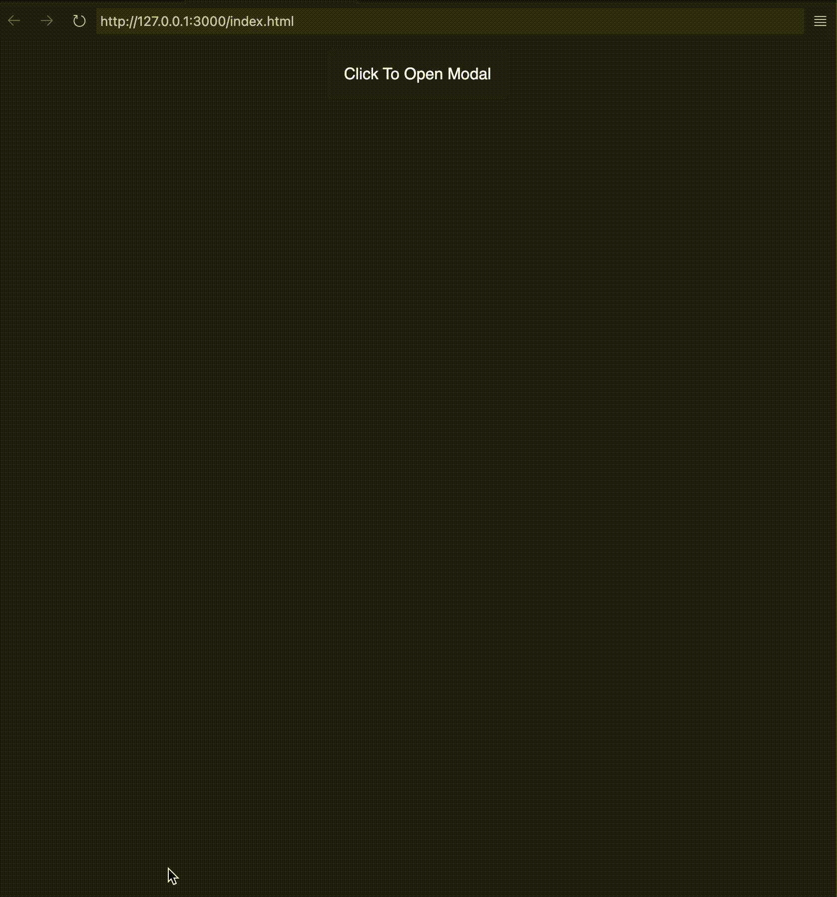

# Desafio: Criando um Modal com HTML e CSS

## Explicação
Neste desafio, seu objetivo é criar um site utilizando apenas elementos HTML e propriedades CSS. O site deve conter um botão que, ao ser clicado, abre um modal. Dentro do modal, deve haver outro botão que permita fechar o modal.

## Resultado



## Dicas

- Utilize a tag ```<dialog>``` do HTML para criar o modal

- Utilize a pseudo-classe ```:target``` do CSS para criar o efeito de abrir e fechar o modal

## Uso

### Dialog

A tag ```<dialog>``` permite criar modais dentro de uma página HTML de forma nativa, sem a necessidade de JavaScript para exibição básica. Aqui estão os pontos principais:

- Uso: ```<dialog>``` define o conteúdo do modal, como texto, formulários, ou qualquer outro elemento HTML.

- Comportamento padrão: Por padrão, um ```<dialog>``` é oculto (display: none; no CSS) até que o atributo open seja adicionado ao elemento.

- Interatividade: Pode-se usar botões e links dentro do modal para fechar ou realizar ações adicionais.

````html
<dialog id="modal" open>
  <h2>Dialog</h2>
  <p>Este é um dialog comum</p>
</dialog>
````

### :target

A pseudo-classe ```:target``` é usada para estilizar um elemento que é o alvo de um link na URL atual. Aqui está como ela funciona:

- Seleção: :target seleciona um elemento cujo ID corresponde ao fragmento na URL. Por exemplo, se houver um link com href="#modal" e o usuário clicar nele, a URL será atualizada para incluir #modal. Isso faz com que o elemento com id="modal" se torne o alvo (:target).

- Aplicação: No CSS, podemos usar :target para estilizar o elemento que se torna o alvo na URL. Por exemplo:

````css
dialog {
  display: none; /* Oculta o modal inicialmente */
}

dialog:target {
  display: block; /* Exibe o modal quando se torna o alvo */
}
````